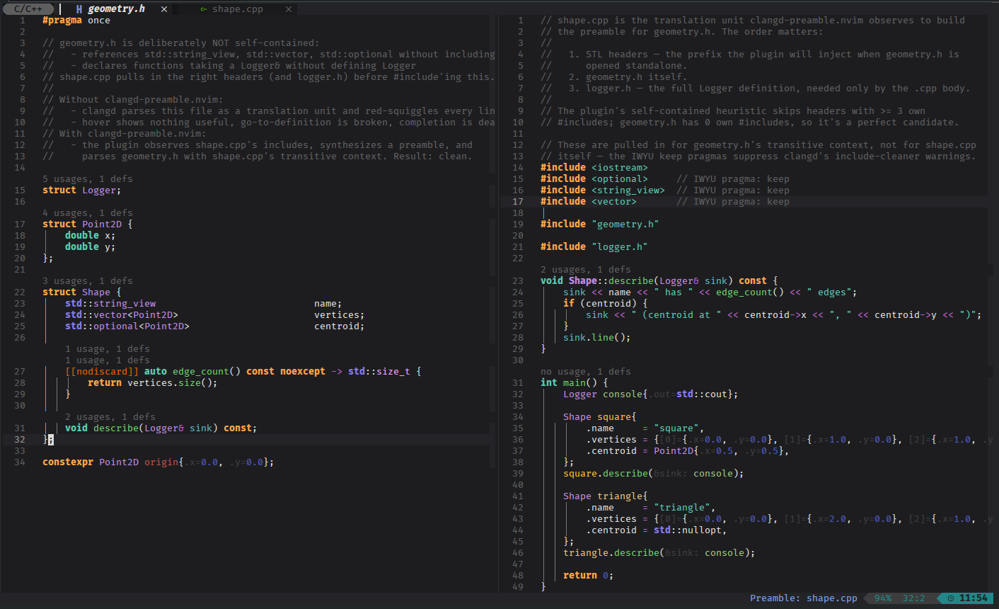

# clangd-preamble.nvim

Make non-self-contained C/C++ headers parse cleanly under clangd.




When a header relies on transitive includes from its TU's preamble (`std::string_view`
without `#include <string_view>`, `CObject` forward-decls without the full type, etc.),
clangd parsed alone produces a cascade of false-positive errors, broken hover, broken
go-to-def, and so on. This plugin observes outgoing `didOpen` notifications to build
a TU→header include graph, synthesizes a fake preamble from a recently-seen includer,
prepends it to the buffer text sent to clangd, and bidirectionally remaps line/col
positions across ~30 LSP request/response methods so the unmodified header is what the
user sees. Diagnostics whose ranges fall in the synthesized preamble are dropped;
edits that target the preamble are filtered out before they hit the buffer.

The synthesized preamble is wrapped in `#if __INCLUDE_LEVEL__ == 0 ... #endif` so it's
only active when clangd parses the header as the translation root — when the same
header is later `#include`'d through some other file's chain the body is skipped, no
redefinition cascades.

## Requirements

- Neovim **0.10+** (`vim.uv`, `vim.fs`, `vim.lsp.handlers`).
- A working `clangd` setup via `nvim-lspconfig` or `vim.lsp.start`.

## Install

### lazy.nvim

```lua
{
  "sr-tream/clangd-preamble.nvim",
  ft = { "c", "cpp", "objc", "objcpp", "cuda" },
}
```

### packer.nvim

```lua
use { "sr-tream/clangd-preamble.nvim" }
```

### vim-plug

```vim
Plug 'sr-tream/clangd-preamble.nvim'
```

## Wire it into your clangd `on_attach`

The plugin doesn't auto-attach to clangd — you wire it from your existing clangd
config. With `nvim-lspconfig`:

```lua
{
  "neovim/nvim-lspconfig",
  opts = {
    servers = {
      clangd = {
        on_attach = function(client, bufnr)
          require("clangd-preamble").attach(client, bufnr)
          -- ...your other on_attach logic
        end,
      },
    },
  },
}
```

If you have other middleware that also wraps `client.request` / `client.notify`
(e.g. a URI-scheme filter), install `clangd-preamble` **after** it so the preamble
layer sits as the outermost wrapper.

Optional setup:

```lua
require("clangd-preamble").setup({
  -- "preamble_size" keeps the current default: pick the includer with the
  -- smallest include prefix before the header. "last_seen" follows the most
  -- recently observed includer TU instead.
  default_selector = "preamble_size",

  -- Persist observed/project-scanned TU include graphs under stdpath("cache")
  -- and restore entries whose file size and mtime still match.
  graph_cache = true,
})
```

## Statusline

Show the active includer TU in your statusline:

```lua
-- lualine_x section
local function clangd_preamble()
  local ok, m = pcall(require, "clangd-preamble")
  if not ok then return "" end
  local tu = m.includer_for()
  if not tu then return "" end
  return "Preamble: " .. (tu:match("([^/\\]+)$") or tu)
end
table.insert(opts.sections.lualine_x, 1, { clangd_preamble, color = { fg = "#7aa2f7" } })
```

## Commands

| Command | Action |
|---|---|
| `:NoSelfContainedDisable` / `:NoSelfContainedEnable` | Global on/off — when off, traffic passes through unchanged |
| `:NoSelfContainedDisableBuf` | Disable synthetic preamble for the current header until re-enabled |
| `:NoSelfContainedEnableBuf` | Re-enable preamble injection for the current header |
| `:NoSelfContainedSelectIncluder` | Choose auto, last-seen, or a fixed includer TU for the current header |
| `:NoSelfContainedRefresh` | Re-pick the includer TU, re-build the preamble, replay didOpen |
| `:NoSelfContainedStatus` | Print state for the current buffer (selection, preamble, includer TU, line count) |
| `:NoSelfContainedDumpGraph` | Dump the observed TU/header graph |
| `:NoSelfContainedDumpDiagnostics` | Dump diagnostics suppressed because they fell in the preamble |
| `:NoSelfContainedScanProject` | Walk `cwd` for `.cpp/.cc/...` files and observe their includes; the graph is cached for later sessions |

## How it works

1. **Include graph.** Outgoing `didOpen` for `.cpp/.cc/.cxx/.c` files is
   intercepted; the file's `#include` directives are parsed into a TU↔header
   graph indexed by basename.
2. **Includer pick.** When the user opens a header, the default selector picks
   the TU with the **shortest prefix-before-this-header** (tie-break: most
   recent observation). `setup({ default_selector = "last_seen" })` can instead
   make the default follow the most recently observed includer TU.
   `:NoSelfContainedSelectIncluder` can pin a specific TU or switch the header
   to last-seen mode. Companion-TU fallback (`Foo.cpp` next to `Foo.h`) covers
   the header-opened-alone case.
3. **Self-contained skip.** Headers with **3 or more own `#include`
   directives** are likely self-contained and skipped automatically — the
   preamble can only introduce conflicts in that case. Manual commands
   (`:NoSelfContainedRefresh`, `:NoSelfContainedEnableBuf`) override.
4. **Cycle filter.** Each prefix entry is checked (1 level deep) against the
   target header's basename — entries that transitively re-include the
   target are dropped to prevent redefinition cascades.
5. **Dedup.** Prefix entries that appear in the header's own `#include` set
   are dropped, and within-prefix duplicates are collapsed —
   `bugprone-duplicate-include` doesn't fire.
6. **Synthesis.** The remaining entries are wrapped in
   `#if __INCLUDE_LEVEL__ == 0 ... // __NSC_PREAMBLE_END__ ... #endif` and
   prepended to the header's `didOpen.text`.
7. **Position remap.** ~30 LSP methods (hover, definition, references,
   completion, semanticTokens full+range+delta, inlayHint, formatting,
   rangeFormatting, prepareRename/rename, codeAction with `context.diagnostics`
   back-shift, documentSymbol, foldingRange, codeLens, selectionRange,
   linkedEditingRange, callHierarchy, typeHierarchy, …) shift positions
   and ranges in both directions so the user sees user-space coordinates.
8. **Diagnostic suppression.** `publishDiagnostics` middleware drops entries
   whose range is fully in the preamble, clips entries straddling the
   boundary, and shifts surviving entries to user-space. Suppressed entries
   are kept for `:NoSelfContainedDumpDiagnostics`.
9. **Pending-header replay.** If a header is opened before any matching TU
   has been observed, the original `didOpen` is stashed; when a later TU's
   `didOpen` populates the graph with a basename match, the stored open is
   replayed via the wrapped notify so the preamble injection runs against
   the saved text. Promotion runs via `vim.schedule` to keep the wrapped
   notify path responsive on large projects.
10. **Graph cache.** Observed and project-scanned TU include entries are stored
    under `stdpath("cache")/clangd-preamble`, keyed by `cwd`. On restore, each
    cached TU is accepted only if its file size and mtime still match. Buffer
    write, file-change, and rename events refresh or invalidate affected TU and
    header entries.

## Caveats

- Header-opened-alone with no companion `.cpp` and no observed/restored TU
  yields a pass-through (no preamble) until either an includer TU's `didOpen`
  is observed or `:NoSelfContainedScanProject` is run.
- Pull-diagnostics (`textDocument/diagnostic`) is not yet handled; rely on
  push (`publishDiagnostics`) for now.
- Headers in two distinct buffers via different paths to the same file are
  treated as separate buffers (each gets its own state).

## License

MIT — see [LICENSE](LICENSE).
